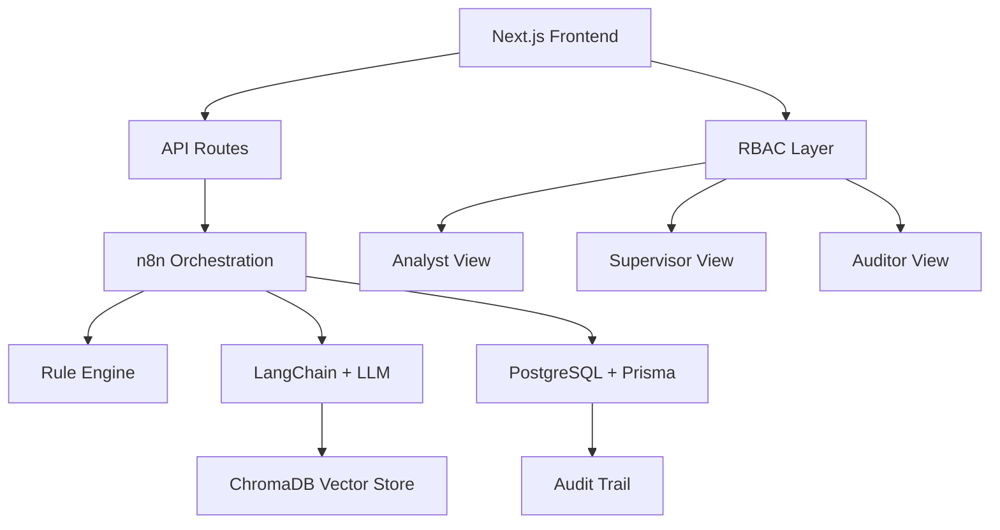

# 🏦 SAR Narrative Generator with Full Audit Trail

<p align="center"><strong>Enterprise AML Compliance Platform for Barclays Hackathon.</strong>
</p>


<p align="center">
  
  
  
</p>

<p align="center">
  <strong>An AI-powered compliance tool that helps analysts generate Suspicious Activity Reports (SARs) with complete transparency, audit trails, and regulatory compliance.</strong>
</p>

<br />

</div>

## 🛠 Technology Stack

<div align="center">

### 🎯 Full-Stack Application

<br />
<sub><strong>Next.js • TypeScript • Tailwind CSS</strong></sub>
<br />
<sub>Analyst UI, approvals, audit views, API routes</sub>

### ⚙️ Orchestration & Workflow

<br />
<sub><strong>n8n (Workflow Automation)</strong></sub>
<br />
<sub>Ingestion, feature engineering, rules, scoring, AI calls, audit logging</sub>

### 🤖 AI & Vector Store
<div style="display: flex; align-items: center; justify-content: center; gap: 20px;">
  
  
  
</div>
<br />
<sub><strong>LLM (Llama/Mistral/GPT) • LangChain • ChromaDB</strong></sub>
<br />
<sub>Controlled narrative generation from templates & guidelines (RAG architecture)</sub>

### 🗄️ Database & ORM

<br />
<sub><strong>PostgreSQL • Prisma ORM</strong></sub>
<br />
<sub>Case data, SAR versions, immutable audit logs</sub>

### 🔐 Access Control

<br />
<sub><strong>RBAC (Role-Based Access Control)</strong></sub>
<br />
<sub>Analyst • Supervisor • Auditor roles inside Next.js</sub>

### 🚀 DevOps & Deployment

<br />
<sub><strong>Docker • Docker Compose • Git • GitHub • npm</strong></sub>
<br />
<sub>Local development + cloud/on-prem ready containerization</sub>

### 📊 Data Visualization & UI Libraries

<br />
<sub><strong>Recharts • Material UI • Lucide Icons • Motion</strong></sub>
<br />
<sub>Interactive charts, enterprise components, smooth animations</sub>

</div>

---

## 📋 Table of Contents

- [Overview](#-overview)
- [Key Features](#-key-features)
- [Technology Stack](#-technology-stack)
- [Screenshots](#-screenshots)
- [User Roles](#-user-roles)
- [Getting Started](#-getting-started)
- [Project Structure](#-project-structure)
- [Design System](#-design-system)
- [Security & Compliance](#-security--compliance)
- [Future Enhancements](#-future-enhancements)
- [Contributing](#-contributing)
- [License](#-license)

---

## 🎯 Overview

The **SAR Narrative Generator** is an enterprise-grade Anti-Money Laundering (AML) compliance platform designed as an internal banking tool. It revolutionizes the SAR creation process by combining:

- 🤖 **AI-Powered Narrative Generation** - Leveraging LLMs to create compliant, professional SAR narratives
- 📊 **Structured Data Management** - Handling customer, account, and transaction data with precision
- 🔍 **Complete Audit Trail** - Every action tracked and logged for regulatory compliance
- 👥 **Role-Based Access Control** - Three-tier permission system for Analysts, Supervisors, and Auditors
- 📈 **Risk Analytics Dashboard** - Real-time insights into suspicious activity patterns

This platform addresses the critical need for **transparency** and **auditability** in AI-assisted compliance workflows, ensuring human oversight remains central to the decision-making process.

---

## ✨ Key Features

### 🎨 **Seven Comprehensive Screens**

| Screen | Description | Access Level |
|--------|-------------|--------------|
| **Login** | Secure authentication with role selection | All Users |
| **Dashboard** | Overview of active cases, pending reviews, and metrics | All Users |
| **Generate SAR** | AI-assisted SAR narrative creation with rule engine | Analyst, Supervisor |
| **Audit Trail** | Complete history of all actions and decisions | All Users |
| **Case History** | Track status and progression of all SAR cases | All Users |
| **Risk Analytics** | Visual analytics and pattern detection | Supervisor, Auditor |
| **Role Management** | User permissions and access control | Supervisor |
| **System Logs** | Technical system audit logs | Auditor |

### 🛡️ **Advanced Capabilities**

- ✅ **Rule Engine Integration** - Automated red flags and risk scoring
- ✅ **Real-time Collaboration** - Multiple analysts can work on cases simultaneously
- ✅ **Version Control** - Track all narrative edits with timestamps
- ✅ **Approval Workflows** - Multi-stage review and escalation process
- ✅ **Export Compliance** - Generate regulatory-compliant PDF reports
- ✅ **Dark Mode Enterprise UI** - Professional banking aesthetics
- ✅ **Responsive Design** - Works seamlessly on desktop and tablet devices

---


## 📐 Architecture Overview



---

## 📸 Screenshots

<div align="center">

### Dashboard Overview
*Real-time metrics, active cases, and quick actions*

### Generate SAR Interface
*AI-assisted narrative creation with rule engine validation*

### Audit Trail
*Complete transparency with timestamp tracking*

### Risk Analytics
*Visual insights into suspicious activity patterns*

</div>

---

## 👥 User Roles

The platform implements a **three-tier role-based access control** system:

### 🔵 **Analyst**
- Create and edit SAR narratives
- Submit cases for supervisor review
- Access basic analytics and case history
- View audit trails for own cases

### 🟡 **Supervisor**
- All analyst permissions
- Approve or reject SAR submissions
- Escalate high-risk cases
- Manage team member roles
- Access advanced risk analytics
- Override AI suggestions with justification

### 🟢 **Auditor**
- Read-only access to all data
- Full audit trail visibility
- System logs access
- Export compliance reports
- No editing or approval capabilities

---

## 🚀 Getting Started

### Prerequisites

- Node.js 18.x or higher
- npm or pnpm package manager
- Modern web browser (Chrome, Firefox, Safari, Edge)

### Installation

1. **Clone the repository**
   ```bash
   git clone https://github.com/yourusername/sar-narrative-generator.git
   cd sar-narrative-generator
   ```

2. **Install dependencies**
   ```bash
   npm install
   # or
   pnpm install
   ```

3. **Start development server**
   ```bash
   npm run dev
   ```

4. **Open in browser**
   ```
   Navigate to http://localhost:5173
   ```

### 🔑 Demo Credentials

```
Analyst Login:
- Employee ID: ex123
- Password: analyst123

Supervisor Login:
- Employee ID: ex456
- Password: supervisor123

Auditor Login:
- Employee ID: ex789
- Password: auditor123
```

### 🏗️ Build for Production

```bash
npm run build
```

The production-ready files will be generated in the `dist/` directory.

---

## 📁 Project Structure

```
sar-narrative-generator/
├── src/
│   ├── app/
│   │   ├── components/          # Reusable UI components
│   │   │   ├── Header.tsx
│   │   │   ├── Sidebar.tsx
│   │   │   ├── Layout.tsx
│   │   │   ├── MetricCard.tsx
│   │   │   ├── RiskBadge.tsx
│   │   │   ├── StatusBadge.tsx
│   │   │   └── ui/              # Shadcn UI components
│   │   ├── context/             # React Context providers
│   │   │   └── RoleContext.tsx  # Role-based access control
│   │   ├── pages/               # Screen components
│   │   │   ├── Login.tsx
│   │   │   ├── Dashboard.tsx
│   │   │   ├── GenerateSAR.tsx
│   │   │   ├── AuditTrail.tsx
│   │   │   ├── CaseHistory.tsx
│   │   │   ├── RiskAnalytics.tsx
│   │   │   ├── RoleManagement.tsx
│   │   │   └── SystemLogs.tsx
│   │   ├── routes.ts            # React Router configuration
│   │   └── App.tsx              # Application root
│   └── styles/
│       ├── index.css
│       ├── theme.css            # Design tokens
│       ├── tailwind.css
│       └── fonts.css
├── package.json
├── vite.config.ts
└── README.md
```

---

## 🎨 Design System

### Color Palette

The platform uses a **professional enterprise banking theme** with risk-based color coding:

```css
/* Primary Background */
--background: #0F172A;        /* Dark Navy */

/* Card Surfaces */
--card-background: #1E293B;   /* Slate */

/* Risk Levels */
--risk-high: #EF4444;         /* Red - Critical Risk */
--risk-medium: #F59E0B;       /* Amber - Medium Risk */
--risk-low: #10B981;          /* Green - Low Risk */

/* Accents */
--primary: #3B82F6;           /* Blue - Primary Actions */
--text-primary: #F1F5F9;      /* Light Gray - Primary Text */
--text-secondary: #94A3B8;    /* Muted Gray - Secondary Text */
```

### Typography

- **Font Family**: Inter (Google Fonts)
- **Headings**: 600-700 weight
- **Body**: 400-500 weight
- **Code/Data**: Monospace fallback

### Design Principles

✅ **Regulatory Compliance** - No gradients, playful elements, or distracting animations  
✅ **High Contrast** - WCAG AA accessibility standards  
✅ **Data Density** - Information-rich layouts for professional users  
✅ **Consistent Spacing** - 8px grid system  
✅ **Clear Hierarchy** - Visual weight reflects importance  

---

## 🔒 Security & Compliance

### Audit Trail Features

- **Immutable Logs** - All actions permanently recorded
- **Timestamp Precision** - Millisecond-accurate tracking
- **User Attribution** - Every change linked to specific user
- **Change History** - Before/after comparisons for all edits

### Data Handling

- **Mock Data Only** - Prototype uses synthetic data
- **No Real PII** - Compliant with data protection regulations
- **Session Management** - Role-based context persistence
- **Input Validation** - All forms validated client-side

### Production Considerations

⚠️ **This is a hackathon prototype.** For production deployment:

- Implement backend API with proper authentication (OAuth 2.0 / SAML)
- Use encrypted database for sensitive data
- Add rate limiting and DDoS protection
- Implement HTTPS and certificate pinning
- Add comprehensive logging and monitoring
- Conduct security penetration testing
- Ensure GDPR/regulatory compliance

---

## 🚧 Future Enhancements

### Planned Features

- [ ] **LLM Integration** - Connect to GPT-4 or Claude for real narrative generation
- [ ] **Backend API** - Node.js/Python backend with PostgreSQL
- [ ] **Real-time Collaboration** - WebSocket support for multi-user editing
- [ ] **Advanced Analytics** - ML-based pattern detection
- [ ] **PDF Export** - Regulatory-compliant report generation
- [ ] **Email Notifications** - Alert supervisors of pending approvals
- [ ] **Search & Filter** - Advanced case search capabilities
- [ ] **Mobile App** - React Native companion app
- [ ] **Multi-language** - i18n support for global teams
- [ ] **Dark/Light Mode** - User preference toggle

### Technical Improvements

- [ ] Unit and integration testing (Jest, React Testing Library)
- [ ] E2E testing (Playwright)
- [ ] CI/CD pipeline (GitHub Actions)
- [ ] Docker containerization
- [ ] Performance optimization (code splitting, lazy loading)
- [ ] Accessibility audit and improvements

---

## 🤝 Contributing

This is a hackathon prototype, but contributions are welcome!

### How to Contribute

1. Fork the repository
2. Create a feature branch (`git checkout -b feature/AmazingFeature`)
3. Commit your changes (`git commit -m 'Add some AmazingFeature'`)
4. Push to the branch (`git push origin feature/AmazingFeature`)
5. Open a Pull Request

### Code Style

- Follow existing TypeScript conventions
- Use functional components and hooks
- Keep components under 300 lines
- Add comments for complex logic
- Use meaningful variable names

---

## 📄 License

This project is licensed under the **MIT License** - see the [LICENSE](LICENSE) file for details.

---

## 👨‍💻 Author

Built with ❤️ for the **Barclays Hackathon 2026**

### Contact

- **GitHub**: [@yourusername](https://github.com/yourusername)
- **Email**: your.email@example.com
- **LinkedIn**: [Your Name](https://linkedin.com/in/yourprofile)

---

## 🙏 Acknowledgments

- **Barclays** for hosting the hackathon and inspiring this solution
- **Shadcn/ui** for the excellent component library
- **Recharts** for powerful data visualization
- **Lucide** for beautiful iconography
- **Tailwind CSS** for rapid styling
- **React Router** for robust navigation

---

<div align="center">

### ⭐ Star this repository if you find it useful!

**Made with 🏦 for enterprise AML compliance**

<p>
  <sub>Disclaimer: This is a prototype for demonstration purposes. Not intended for production use without proper security hardening and regulatory compliance verification.</sub>
</p>

</div>
